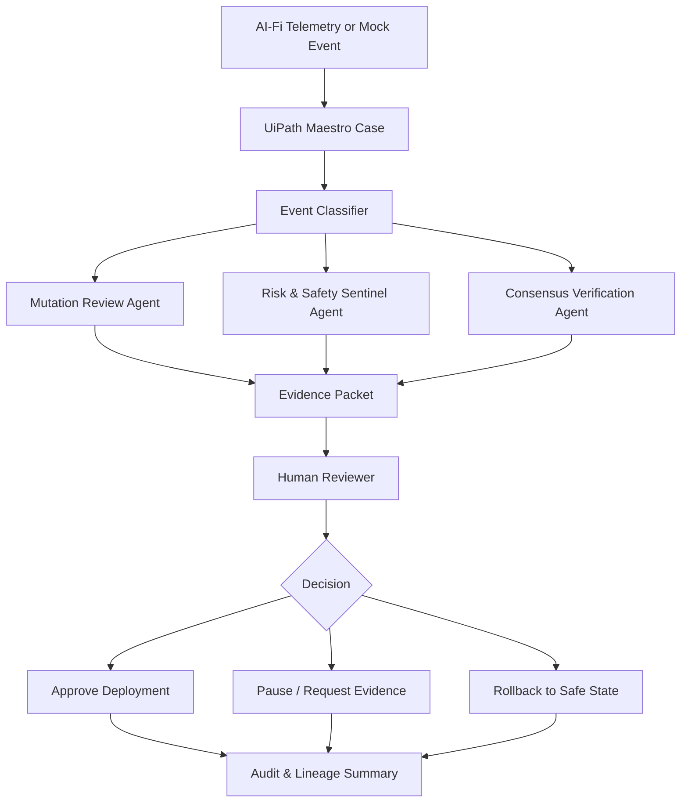

# AI-Fi Sovereign Sentinel

AI-Fi Sovereign Sentinel is a public-safe UiPath AgentHack prototype that demonstrates governed case orchestration for self-mutating autonomous financial agents.

The project shows how UiPath Maestro Case can turn high-impact autonomous events, including code mutation proposals, strategy parameter changes, consensus checks, safety alerts, capital-sweep events, and rollback decisions, into auditable human-supervised workflows.

This repository is a hackathon-safe wrapper. It does not include proprietary AI-Fi source code, trading strategies, private five-node cluster configuration, credentials, broker integrations, wallet keys, or production secrets.

## Hackathon Track

UiPath AgentHack - Track 1: UiPath Maestro Case

## Problem

Autonomous agents are beginning to do more than answer questions. They can write code, operate infrastructure, reason over telemetry, and trigger real-world actions.

In high-stakes domains such as finance, an autonomous system that can mutate its own strategy code or propose capital movement cannot be governed only through logs. It needs:

- Case state.
- Safety review.
- Consensus checks.
- Human approval.
- Rollback paths.
- Audit evidence.

## Solution

AI-Fi Sovereign Sentinel uses UiPath as the governance and orchestration layer around autonomous financial-agent operations.

The prototype creates cases for:

- Strategy mutation proposals.
- AST code-change review.
- Risk-bound changes.
- Cluster consensus checks.
- Trade or capital-action proposals.
- Sentinel anomalies.
- Rollback-to-safe-state decisions.
- Final audit summaries.

Agents analyze the event and produce recommendations. UiPath coordinates the workflow. Humans retain override authority.

## Architecture

## Case Stages

1. Event intake.
2. Action classification.
3. Mutation and risk review.
4. Consensus verification.
5. Human approval or override.
6. Deploy, pause, or rollback routing.
7. Audit and lineage summary.

## Demo Flow

1. Open UiPath Automation Cloud and the Sovereign Sentinel case.
2. Submit a sample `strategy_mutation_proposed` event.
3. Run mutation, safety, and consensus review agents.
4. Route an evidence packet to a human reviewer.
5. Choose approve, pause, or rollback.
6. Generate a final audit and lineage summary.

## Public-Safe Boundary

This demo uses mock or sanitized event payloads. It does not provide investment advice, execute trades, custody funds, sign transactions, or expose private AI-Fi infrastructure.

## License

MIT License for the public demo wrapper only.
