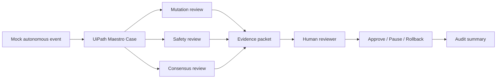

# Architecture

AI-Fi Sovereign Sentinel demonstrates a UiPath-governed case workflow for autonomous-agent operations.

## Components

- AI-Fi telemetry or mock event source.
- UiPath Maestro Case.
- Event Classifier.
- Mutation Review Agent.
- Risk & Safety Sentinel Agent.
- Consensus Verification Agent.
- Human Reviewer.
- Deploy/Pause/Rollback routing.
- Audit and lineage summary.

## Flow

## Public-Safe Boundary

The demo intentionally excludes:

- Private cluster endpoints.
- SSH configuration.
- Trading strategy source code.
- Wallet keys.
- Broker credentials.
- Live client or account data.
- Production secrets.
